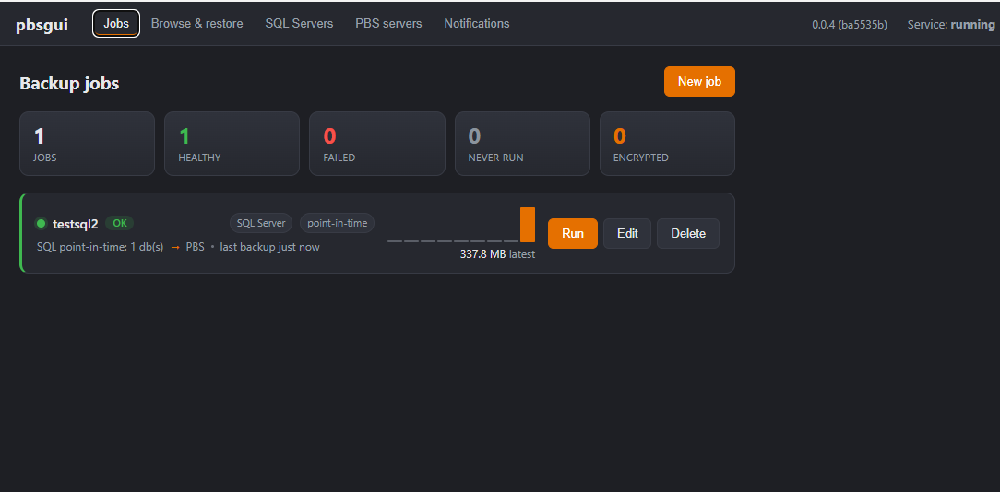
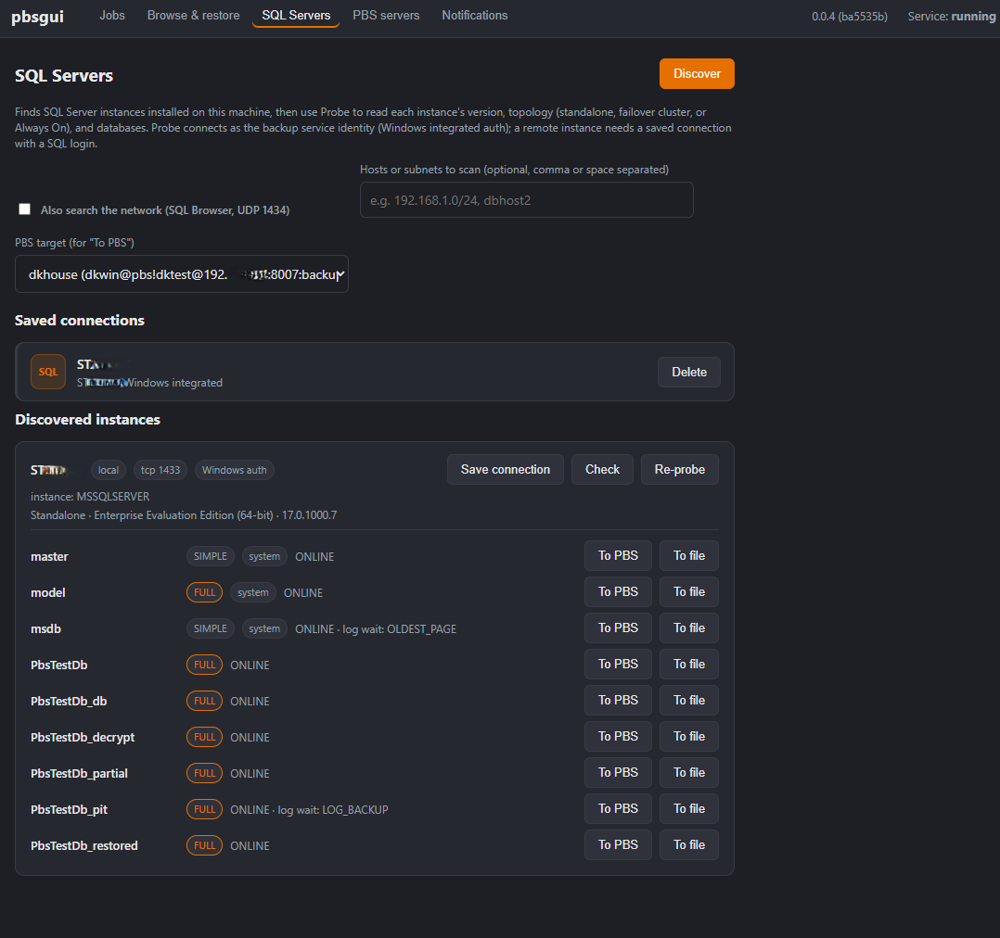
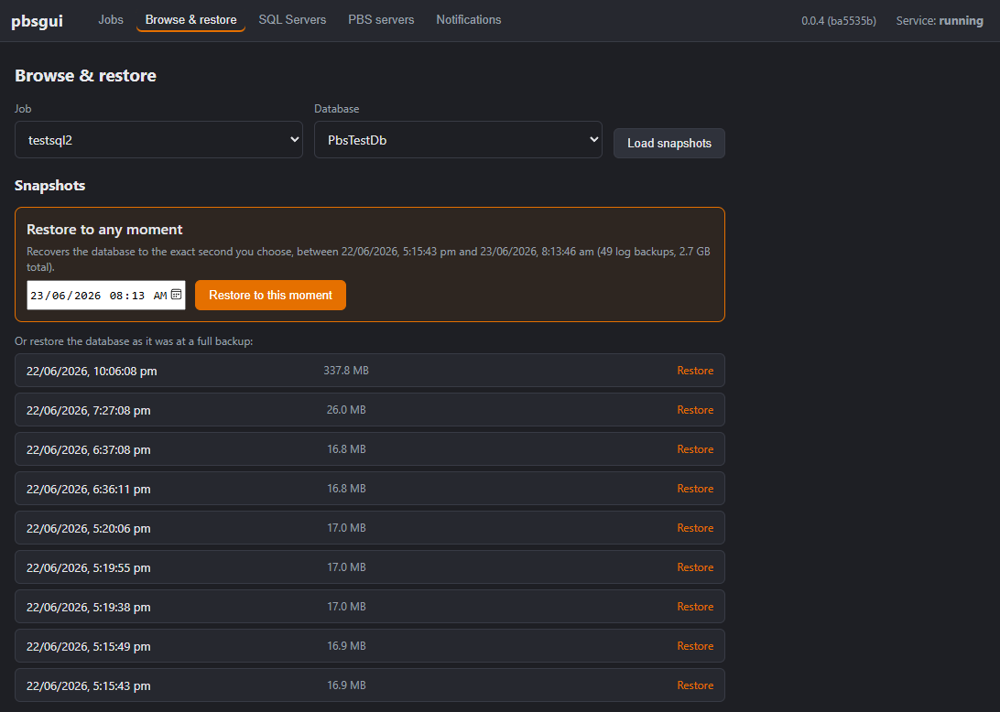
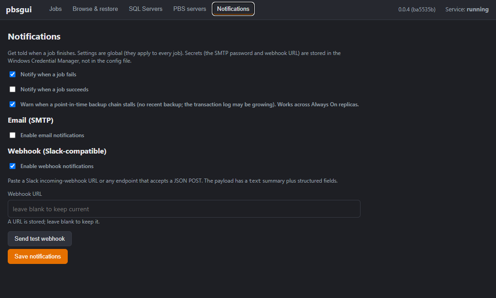
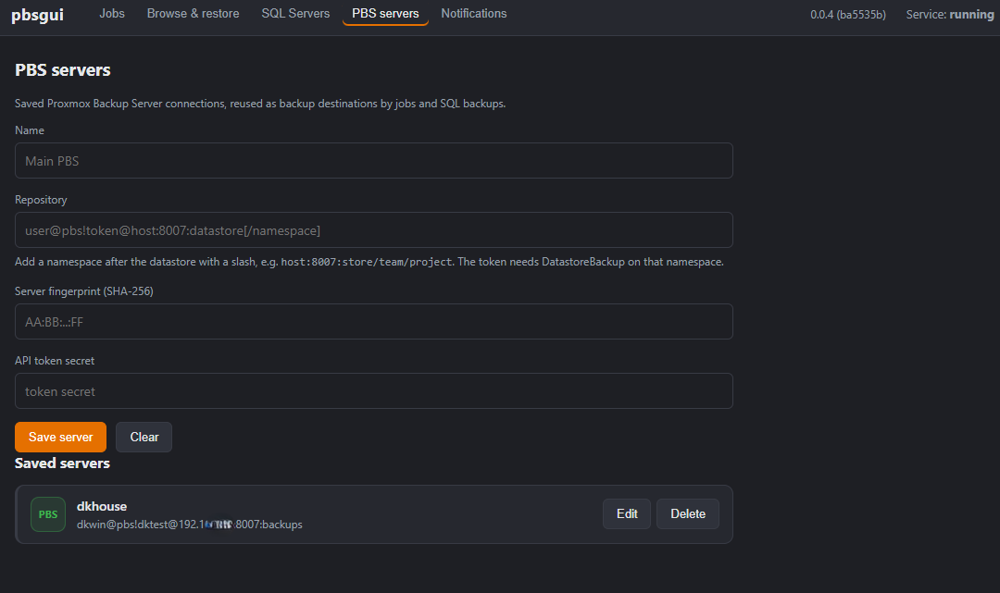

# pbsgui

A Windows GUI for backing up Windows machines and Microsoft SQL Server to a
Proxmox Backup Server (PBS), with browse and restore.

pbsgui talks to PBS using a clean-room Rust reimplementation of the PBS backup
protocol, so it does not embed the official client and is free to ship under its
own license (GPL-3.0).

Requires **Proxmox Backup Server 4.2 or newer**. (Older 3.x servers reject the
backup with a 403 at the protocol upgrade and are not supported.)

## Goals

- Back up Microsoft SQL Server (standalone, Failover Cluster Instance, and Always
  On Availability Groups) directly to PBS, including full, differential, and
  transaction-log backups, with correct log-chain management.
- Back up generic Windows files and folders to PBS with content-defined chunking
  and incremental, server-side deduplication.
- Browse snapshots by date and time and restore them in full or in part.
- Optionally encrypt backups on the client with AES-256-GCM, byte-compatible with
  the PBS encryption scheme, so the server never sees the key.
- Run unattended as a Windows service, with a tray-based GUI for configuration
  and monitoring that can be closed without stopping backups.
- Be easy to operate: discover SQL Server instances, store secrets in the OS
  credential store, and (planned) report job outcomes through notifications.

## Architecture

pbsgui is split into two processes:

- **`pbsgui` (the GUI)** is an unprivileged [Tauri](https://tauri.app) app: a Rust
  core with a static HTML/CSS/JS front end (no JS build step). It only configures
  and monitors; it never performs backups itself, so closing it never stops a
  running backup.
- **`pbsgui-engine` (the engine)** does the privileged work: it runs the backup
  protocol, the scheduler, SQL Server integration, and secret storage. It runs as
  a Windows service (LocalSystem) in production, or in the foreground during
  development.

The two communicate over a local socket (a named pipe on Windows, a Unix domain
socket on Linux) using newline-delimited JSON. The socket name is versioned so a
newer GUI never connects to a stale engine.

The PBS protocol itself is reimplemented from the published protocol
documentation: the HTTP/1.1 to HTTP/2 upgrade, TLS certificate-fingerprint
pinning, the data-blob and fixed/dynamic index formats, FastCDC content-defined
chunking, and incremental deduplication against a previous snapshot.

## Workspace layout

| Path | Purpose |
| --- | --- |
| `crates/pbs-client` | Clean-room PBS protocol client: sessions, blobs, indexes, chunking, REST. |
| `crates/pbsgui-ipc` | Shared GUI/engine message types and the local-socket transport. |
| `crates/pbsgui-engine` | The privileged engine: backup, scheduler, secrets, SQL, the service. |
| `src-tauri` | The Tauri desktop application (commands, tray, window behavior). |
| `ui/` | Static front end (HTML/CSS/JS) served by the Tauri app. |
| `docs/` | This documentation. |

## Screenshots

| | |
| --- | --- |
|  |  |
| Jobs dashboard with status and size-over-time graphs | SQL Server discovery, connections, and databases |
|  |  |
| Browse and point-in-time restore | Notifications |
|  | |
| PBS servers | |

See [screenshots/README.md](screenshots/README.md) for how these are captured.

## More

- [STATUS.md](STATUS.md) - what works today, what is in progress, and the roadmap.
- [DEVELOPERS.md](DEVELOPERS.md) - prerequisites, building, testing, and the dev loop.
- [TESTING.md](TESTING.md) - the test tiers and the manual integration / point-in-time pass.
- [ARCHITECTURE.md](ARCHITECTURE.md) - components, the SQL Server backup strategy, and the storage model.
